## SpectrumLeds
**7 band microphone spectrum analyser leds with wifi interface.**  

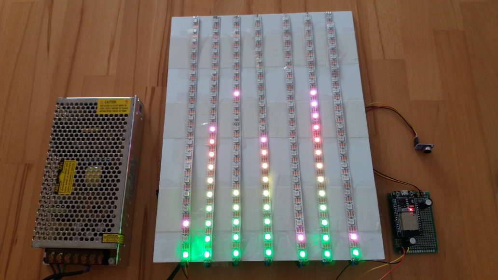  

**Circuit Board**  
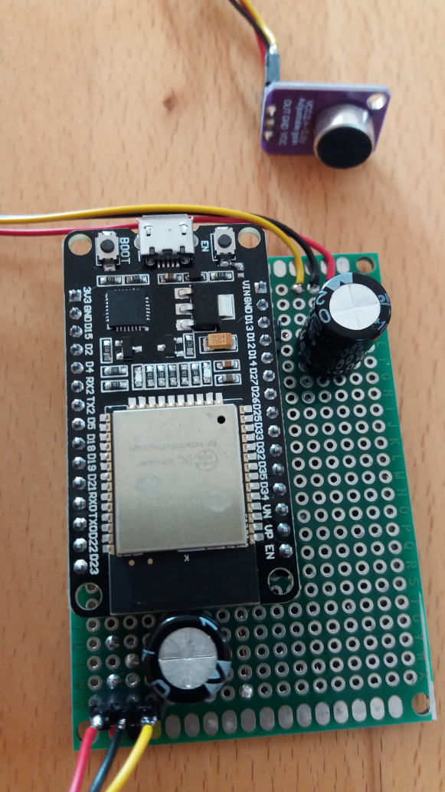

**Wifi interface**  
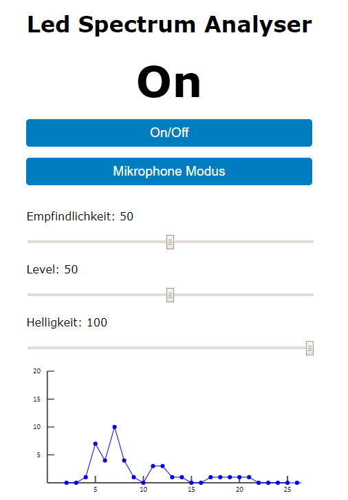

### Description
This board samples environment sounds with an external microphone and 
calculate the 7 band sound spectrum with a software fast fourier transformation
and display the result on an 7 RGB led lines.

The main component of the systems are:
* A NodeMCU ESP32 board
* MAX4466 microphone
* 5V 20A AC/DC power supply
* 140 x WS2812B RGB led
* 2 x Electrolytic Capacitor 1000uF

### Disclaimer
   I don't take any responsibility nor liability for using this software nor for the 
   installation or any tips, advice, videos, etc. given by any member of this site or any related site.

### License
   This program is licensed under GPL-3.0

### Circuit
   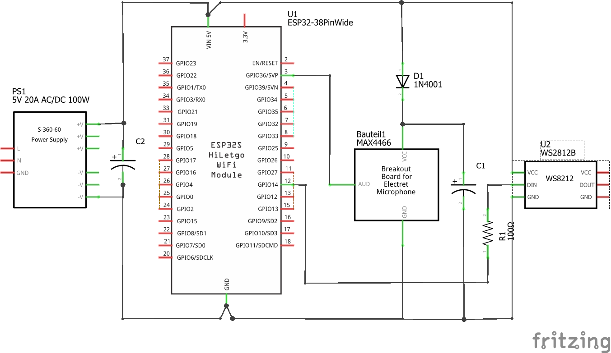

### Part and Shopping list
Here are some sample shopping items. Please check the details if everything is correct.

|Label              |Price         |Image                                    | Sample URL           |
|-------------------|--------------|-----------------------------------------|----------------------|
|NodeMCU-32S        |12 CHF        | 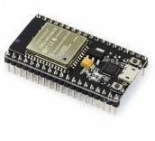          | https://www.bastelgarage.ch/nodemcu-32s-esp32-wifi-bluetooth-entwicklungs-board |
|WS2812B 60LED      |52 CHF 14 pcs | 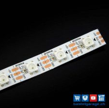          | https://www.bastelgarage.ch/ws2812b-60led-m-led-neopixel-strip-0-165m?search=ws2812b |
|MAX4466 microphone |6 CHF         | 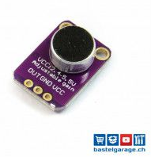    | https://www.bastelgarage.ch/max4466-mikrofon-verstarker-modul-mit-poti?search=max4466 |
|5V 20A AC/DC       |30 CHF        | 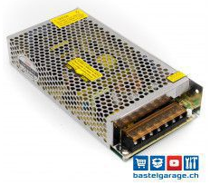 | https://www.bastelgarage.ch/5v-20a-ac-dc-100w-schaltnetzteil-s-100-5?search=5v%20100w |
|1000uF Capacitor   |2 CHF 2 pcs   | 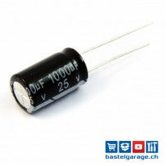      | https://www.bastelgarage.ch/elektrolyt-kondensator-1000-f-25-v?search=1000 |
|100 Ohm resistor   |1 CHF         | 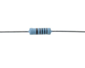        | https://www.amazon.de/Metallfilm-Widerstand-100-Ohm-Stück/dp/B00AES20G0/ref=sr_1_3_sspa |
|Diode              |1 CHF         | 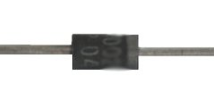              | https://www.amazon.de/1N4007-Diode-Gleichrichterdiode-1000-Stück/dp/B017HTKGL4/ref=sr_1_1 |

The material price should be approx. **100 CHF**.

### Thanks
   * https://www.arduino.cc
     *Thanks to the Arduino community with all its incredible possibilities and support.** 
   * http://fritzing.org/home
     *Thanks to the fritzing team for this very intuitive usable software.* 
     I could create my circuit in Fritzing with only a half day.
